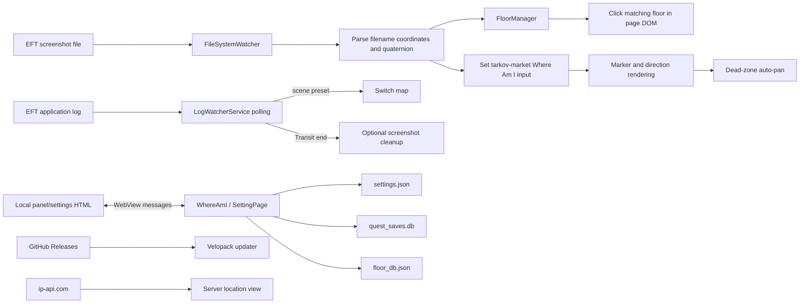

# Reverse-engineering notes

## Baseline and scope

Analyzed baseline: upstream `main` at commit `9f40eaf` (application version
2.3.6). This is source-level analysis of an MIT-licensed repository, not binary
decompilation.

The application does not read Escape from Tarkov process memory or inject code
into the game. It reads game-created screenshots and logs, installs a Windows
low-level keyboard hook, and injects JavaScript into its own WebView2 instance
that displays `tarkov-market.com`. The project's own warning about possible game
sanctions still applies.

## Runtime data flow



## Component map

| Component | Responsibility | Main coupling |
| --- | --- | --- |
| `Program.cs` | Velopack startup and WinForms entry point | Velopack package lifecycle |
| `Form1.cs` | Shell navigation and update check | Hard-coded upstream GitHub URL |
| `UserControls/WhereAmI.cs` | Main orchestration | Filesystem, settings, both WebViews, logs, hotkeys |
| `Classes/JavaScriptExecutor.cs` | DOM operations and JS/C# bridge | tarkov-market DOM and button text |
| `Classes/Constants.cs` | Selectors and large injected scripts | Nuxt structure, CSS classes, map DOM |
| `Classes/LogWatcherService.cs` | Poll newest log and detect map/raid end | EFT log names and line formats |
| `Classes/FloorManager.cs` | Polygon/Z-range floor selection and editor persistence | Mutable `floor_db.json` |
| `Classes/QuestRepository.cs` | Per-map saved quests | SQLite beside the executable |
| `Classes/SettingsHandler.cs` | Settings and EFT path discovery | Current working directory, registry, process path |
| `Classes/GlobalHotkeyManager.cs` | Ctrl+Numpad floor commands while EFT is focused | Win32 hooks and process name |
| `UserControls/ServerLocation.cs` | Extract endpoint IP and resolve geolocation | Log text and plain-HTTP ip-api endpoint |
| `html/*.html` | Local WebView UI | Stringly typed `postMessage` action protocol |

The largest change hotspots are `WhereAmI.cs`, `Constants.cs`, and
`JavaScriptExecutor.cs`. They combine orchestration, third-party DOM knowledge,
and UI behavior, so unrelated modifications can regress each other.

## Startup sequence

1. Velopack initializes, then `Form1` creates the three user controls.
2. `WhereAmI` loads mutable settings and tries to discover the screenshot path.
3. A local-panel WebView and a tarkov-market content WebView are created with
   unique temporary user-data folders.
4. The content WebView receives the auto-pan script before document creation and
   navigates to `/maps/{latest_map}`.
5. `JavaScriptExecutor`, SQLite quest storage, floor data, log polling, file
   watching, and the global keyboard hook are initialized.
6. After a fixed four-second delay, the code clicks full-screen and Where Am I
   controls in the remote page and injects the direction-indicator script.

The fixed delays and page-dependent initialization are race-prone. Prefer a
capability probe plus bounded retry when modifying this area.

## Input contracts

### Screenshot filename

Expected form:

```text
YYYY-MM-DD[HH-MM]_x, y, z_quatX, quatY, quatZ, quatW_speed
```

The entire filename (without `.png`) is sent to the remote page. `WhereAmI.cs`
separately parses `parts[1]` as invariant-culture `x, y, z`. The direction script
parses `parts[2]` as the quaternion. There is no central parser or validation
result type, making this a high-value first extraction for unit tests.

### Log lines

Map detection uses:

```text
scene preset path:maps/<preset>.bundle
```

Raid end uses a `[Transit]` line with a hexadecimal identifier, count, and
`EventPlayer` flag. Unknown presets are only logged. The map alias table is
embedded in `LogWatcherService.cs`.

### WebView messages

The local HTML pages and C# exchange JSON with an `action` string. Important
actions include map selection, screenshot/log settings, theme/language updates,
quest toggles, and floor-zone edits. There is no shared schema or version field.

## Persistent and temporary state

| State | Current location | Concern |
| --- | --- | --- |
| Settings | `assets/settings.json` relative to process working directory | Source/install directory may be mutated; default contains a machine-specific log path |
| Quests | `quest_saves.db` beside the executable | Updates/reinstalls and read-only locations can lose or block data |
| Floor database | `floor_db.json` beside the executable | Shipped reference data and user edits are mixed |
| App log | `app.log` beside the executable | Can fail silently in read-only installs; no rotation |
| WebView profiles | Random folders below `%TEMP%` | A new pair is created per view/session and never explicitly removed |

The modified edition should place mutable state under a product-specific
`%LocalAppData%` directory, copy defaults on first run, and migrate existing
files once.

## External integration anchors

- Map provider: `https://tarkov-market.com/maps/{map}`.
- Updater: `https://github.com/karpitony/eft-where-am-i` appears in both
  `Form1.cs` and `SettingPage.cs`.
- Help/issues links: original GitHub URLs appear in C# and local HTML.
- Server geolocation: `http://ip-api.com/json/{ip}` is unencrypted.
- Release workflow: package ID `eft-where-am-i`, executable name
  `EFT-Where-Am-I.exe`, and the original repository URL are hard-coded.

Do not ship a fork before these identifiers are changed. Keep the original MIT
copyright and license notice when copying or distributing substantial portions.
Use of third-party map content/UI is a separate dependency from the source-code
license and should be reviewed before public distribution.

## Fragile compatibility points

1. Absolute Nuxt selectors for three remote-page buttons.
2. Generic selectors such as `.marker`, `#map`, and `div.items.scroll`.
3. English button-text detection for panel visibility.
4. Fixed 300 ms to four-second delays around remote-page updates.
5. Duplicate auto-pan JavaScript in `Constants.cs` and the browser test page.
6. Log polling chooses newest folders by creation time and files by write time.
7. `async void` event paths make failures and reentrancy difficult to test.
8. The global hook does not currently surface installation failure.

## Recommended seams for the modified edition

- `IMapPageAdapter`: navigation, marker update, floor selection, panel and quest
  operations. Keep every third-party selector inside one adapter.
- `ScreenshotPoseParser`: parse filename into a typed position/quaternion result.
- `IEftLogParser`: pure line parser returning `MapDetected` or `RaidEnded` events.
- `IAppPaths`: provide separate install, configuration, database, log, cache, and
  temporary paths.
- `IUpdateSource`: fork-specific release source, disabled in debug builds.
- Typed WebView message records with a protocol version.
- Shared JavaScript assets loaded by both production and browser harnesses.

These seams permit replay tests with captured filenames/log lines and local DOM
fixtures, without starting the game or contacting the live map provider.

## Security and privacy observations

- Server IP addresses are sent to a third-party geolocation service over HTTP.
- WebView content receives broad script injection and CDP mouse events; navigation
  should be restricted to the expected host before any privileged action.
- Logs can contain paths, IP addresses, and page details. Add rotation and a
  redaction/export path before requesting diagnostic logs from users.
- Automatic raid-end cleanup deletes every PNG in the configured directory. A
  safer fork should validate that the directory is the EFT screenshot folder,
  scope deletion to the current raid, and offer a recycle-bin or backup option.
- Update URLs must point to infrastructure controlled by the fork maintainer and
  packages should be signed before public distribution.
